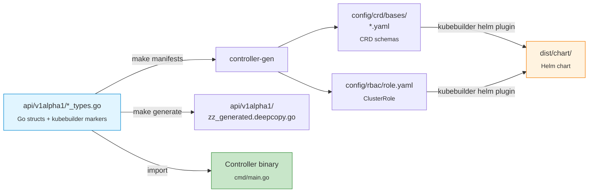
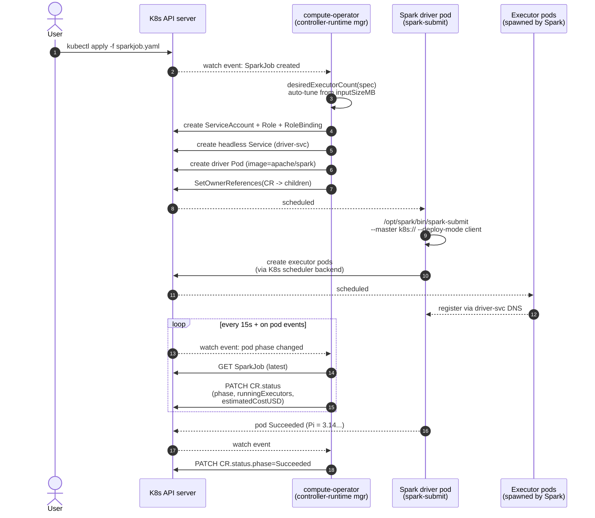
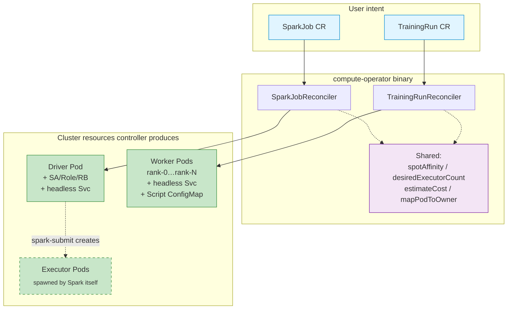

# compute-operator

A Kubernetes operator that runs **Apache Spark jobs** and **distributed PyTorch training** as first-class custom resources. Built with [kubebuilder](https://book.kubebuilder.io/) v4 in Go.

Two CRDs (`SparkJob`, `TrainingRun`) share one controller binary and a common set of cross-cutting features: spot-aware scheduling, executor/worker auto-tuning, GPU plumbing, checkpoint hooks, and live cost accounting.

---

## Why this exists

`spark-on-k8s-operator` and `kubeflow/training-operator` already cover the basics. This project differentiates by:

- **One CRD shape across Spark and ML.** `phase`, `estimatedCostUSD`, `spot.maxRetries`, `resourceHint.inputSizeMB`, `gpu.*` — same fields, same status, one dashboard reads both.
- **Auto-tuned executor/worker counts** from a single `resourceHint.inputSizeMB`, clamped to `[min,max]`.
- **Spot-eviction recovery.** Both controllers track `retries`/`resumes` against `spot.maxRetries` and recreate the workload.
- **Real `spark-submit`** via Spark's native K8s scheduler backend in client mode — no `spark-operator` dependency.
- **Inline Python scripts** for `TrainingRun` (`spec.script`) materialized as a ConfigMap and mounted at `/scripts/train.py`. No custom image required for demos.
- **Declarative GPU block** (`spec.gpu`) → the controller emits `nvidia.com/gpu` resources, node selector, runtime class, NCCL backend, and `torchrun --nproc_per_node`.

---

## Architecture at a glance

### Codegen pipeline — Go types are the source of truth



### Runtime — what happens when you `kubectl apply` a CR



### Two CRDs, one controller binary, shared subsystems



### What each reconciler does on every pass


**Project layout**

| Path | What's there |
|------|--------------|
| `api/v1alpha1/` | Go types — source of truth for both CRDs |
| `internal/controller/` | Reconcilers + unit/integration tests (envtest) |
| `cmd/main.go` | Manager entrypoint (registers both controllers) |
| `config/` | Kustomize manifests (CRDs, RBAC, Deployment, samples) |
| `config/samples/` | Working `SparkJob` and `TrainingRun` CRs |
| `dist/chart/` | Generated Helm chart (mirror of `config/`) |
| `scripts/install-nvidia-drivers.sh` | Host-level driver install for GPU nodes |
| `Makefile` | Build, test, lint, deploy, GPU stack targets |

---

## Quickstart on k3d (CPU only, no GPUs needed)

```bash
# 1. Cluster
k3d cluster create compute-op --servers 1 --agents 1 --wait
kubectl config use-context k3d-compute-op

# 2. Install CRDs + run the controller locally
make install
make run                                  # foreground; blocks. Open a new terminal for step 3.

# 3. Apply the SparkPi sample
kubectl apply -f config/samples/compute_v1alpha1_sparkjob.yaml

# 4. Watch it
kubectl get sparkjob -w
kubectl get pods -l compute.compute.example.com/sparkjob=sparkpi-sample
kubectl logs sparkpi-sample-driver -f    # look for "Pi is roughly 3.14..."
```

A successful run produces a driver pod (`sparkpi-sample-driver`) + 2 executor pods (`spark-pi-…-exec-1/2`) spawned by Spark itself via the K8s scheduler backend, then all three reach `Completed`.

### BERT-tiny TrainingRun (CPU, gloo backend)

```bash
# Pre-pull the heavy pytorch image once (saves an in-cluster pull):
docker pull pytorch/pytorch:2.5.1-cuda12.4-cudnn9-runtime
k3d image import pytorch/pytorch:2.5.1-cuda12.4-cudnn9-runtime -c compute-op

kubectl apply -f config/samples/compute_v1alpha1_trainingrun.yaml
kubectl logs bert-tiny-ddp-rank-0 -f
```

Expect: `pip install transformers` → `[rank 0/2] handshake OK on backend=gloo` → loss prints over 3 epochs → `[rank 0] training complete`.

---

## GPU setup (real clusters only)

k3d / kind / minikube do **not** support GPUs — the device plugin needs real NVIDIA hardware visible to the kernel. Everything below assumes a real cluster (EKS / GKE / on-prem) with at least one node that has a physical or pass-through NVIDIA GPU.

### Hardware + OS requirements

| Component | Supported |
|-----------|-----------|
| GPU | Any NVIDIA card with compute capability ≥ 5.0 (Maxwell+). Tesla T4 / A10G / A100 / H100 / RTX 3xxx-5xxx all work. |
| Architecture | `x86_64` or `aarch64` (Grace-Hopper). |
| Host OS | Ubuntu 20.04 / 22.04 / 24.04, Debian 12, RHEL 8 / 9, Rocky 9, AlmaLinux 9, Amazon Linux 2023. |
| Kernel | Stock distro kernel; the install script invokes DKMS / kernel-headers automatically. |
| Container runtime | `containerd` (default for k3s / EKS / GKE) or `docker`. CRI-O is supported by the GPU Operator but not by our install script. |
| Kubernetes | 1.27+ |
| Disk | ≥ 10 GB free per node — the driver + CUDA libs are large. |
| RAM | ≥ 4 GB per node for the operator's driver DaemonSet to compile. |

### Step 1 — install host drivers on every GPU node

`scripts/install-nvidia-drivers.sh` handles distro detection, nouveau blacklisting, driver via DKMS, the NVIDIA Container Toolkit, and runtime wiring.

```bash
# Copy the script to each GPU node, run as root, reboot once.
scp scripts/install-nvidia-drivers.sh <node>:/tmp/
ssh <node> 'sudo /tmp/install-nvidia-drivers.sh --reboot'

# Flags:
#   --driver-branch 550   Pin to a specific driver branch (default: latest stable)
#   --reboot              Reboot at the end (driver kmod loads on next boot)
#   --skip-toolkit        Driver only
#   --skip-driver         Toolkit only (driver already installed)
```

**Smoke-test after the node comes back up:**

```bash
ssh <node> 'nvidia-smi'                          # must list the GPU + driver version
ssh <node> 'sudo ctr run --rm --gpus 0 -t \
   docker.io/nvidia/cuda:12.4.1-base-ubuntu22.04 cuda-smoke nvidia-smi'
```

If both work, the host is ready.

### Step 2 — install the NVIDIA GPU Operator (cluster-side)

The Operator installs the device plugin (advertises `nvidia.com/gpu` as an extended resource), the runtime class (`runtimeClassName: nvidia`), and node labels (`nvidia.com/gpu.present=true`, `nvidia.com/gpu.count=N`).

```bash
# Since you pre-installed driver + toolkit via the script, disable the
# operator's own DaemonSets for those (avoids conflicts):
make install-gpu-operator \
  GPU_DRIVER_ENABLED=false \
  GPU_TOOLKIT_ENABLED=false
```

If you skipped the host-install script and want the Operator to do everything:

```bash
make install-gpu-operator        # driver + toolkit enabled
```

**Verify:**

```bash
kubectl -n gpu-operator get pods                      # all Running
kubectl get nodes -L nvidia.com/gpu.present -L nvidia.com/gpu.count
# NAME       …  GPU.PRESENT   GPU.COUNT
# gpu-node-1 …  true          1
kubectl get runtimeclass nvidia                       # exists
kubectl describe node gpu-node-1 | grep -A2 'nvidia.com/gpu'
# Capacity:
#   nvidia.com/gpu: 1
```

### Step 3 — install the operator and run the GPU sample

```bash
make install                                          # CRDs
make deploy IMG=ghcr.io/<you>/compute-operator:v0.1.0 # controller in-cluster
kubectl apply -f config/samples/compute_v1alpha1_trainingrun_gpu.yaml
kubectl logs bert-tiny-ddp-gpu-rank-0 -f
```

What the controller emits for a CR with `spec.gpu.enabled=true, perWorker=1, runtimeClass=nvidia, backend=nccl`:

```yaml
# (generated per worker pod, abridged)
spec:
  runtimeClassName: nvidia
  nodeSelector:
    nvidia.com/gpu.present: "true"
  tolerations:
    - key: nvidia.com/gpu
      operator: Exists
      effect: NoSchedule
  containers:
    - name: worker
      command: ["/bin/sh", "-c"]
      args: ["pip install --quiet transformers==4.44.2 && \
              exec torchrun --nnodes=$WORLD_SIZE --nproc_per_node=1 \
                --node_rank=$RANK --master_addr=$MASTER_ADDR \
                --master_port=$MASTER_PORT /scripts/train.py"]
      env:
        - { name: TORCH_DISTRIBUTED_DEFAULT_BACKEND, value: nccl }
        # …RANK / WORLD_SIZE / MASTER_ADDR / MASTER_PORT
      resources:
        requests: { nvidia.com/gpu: "1" }
        limits:   { nvidia.com/gpu: "1" }
```

### GPU-specific TrainingRun knobs

| Field | Default | Notes |
|-------|---------|-------|
| `gpu.enabled` | `false` | Master switch. When false, no GPU plumbing is added. |
| `gpu.perWorker` | `1` | GPUs per pod. Becomes `nvidia.com/gpu` resource + `torchrun --nproc_per_node`. |
| `gpu.nodeSelector` | `{nvidia.com/gpu.present: "true"}` | Override on non-GPU-Operator clusters (e.g. cloud-provider node labels like `accelerator: a100`). |
| `gpu.runtimeClass` | `""` | Set to `"nvidia"` on clusters where the NVIDIA runtime is registered as a RuntimeClass (true after `install-gpu-operator`). Leave empty if `nvidia` is the cluster's default runtime. |
| `gpu.backend` | `nccl` when enabled, `gloo` otherwise | Collective backend for `torch.distributed`. NCCL required for inter-GPU all-reduce; gloo for CPU. |

### Common GPU pitfalls

| Symptom | Cause | Fix |
|---------|-------|-----|
| Pod stuck `Pending`, `kubectl describe` shows *"0/N nodes available: N node(s) didn't match Pod's node affinity"* | No node is labeled `nvidia.com/gpu.present=true` | GPU Operator not installed, or installed but failed. Check `kubectl -n gpu-operator get pods`. |
| Pod stuck `Pending`, *"Insufficient nvidia.com/gpu"* | All GPUs on labeled nodes are already requested by other pods | Scale up GPU nodes or lower `gpu.perWorker` × `worldSize`. |
| Pod `ContainerCreating` forever, event *"RuntimeClass nvidia not found"* | `runtimeClass: nvidia` is set but the RuntimeClass object doesn't exist | `kubectl get runtimeclass`; if missing, install/reinstall GPU Operator, or set `gpu.runtimeClass: ""`. |
| Pod `CrashLoopBackOff` with *"CUDA initialization: no CUDA-capable device is detected"* inside the container | Driver version older than what CUDA in the image needs | Match driver to CUDA: PyTorch 2.5 + CUDA 12.4 needs driver ≥ 550. Re-run `install-nvidia-drivers.sh --driver-branch 550`. |
| NCCL hangs on `init_process_group` | Workers can't reach each other on port 29500 | NetworkPolicy blocking it, or pod security policy. Allow intra-namespace traffic on TCP 29500. |
| `nvidia-smi` works on the host but not in the pod | Container runtime not configured with the nvidia runtime | Re-run `install-nvidia-drivers.sh` (configures `containerd` automatically), or `nvidia-ctk runtime configure --runtime=containerd --set-as-default` manually. |

### What if my cluster has no GPU but I want to dry-run the GPU YAML?

You can apply `compute_v1alpha1_trainingrun_gpu.yaml` on k3d. The CRD validation passes; pods land in `Pending` with `didn't match Pod's node affinity` — that's the controller doing the right thing. It's a useful test that your manifest renders correctly before pushing to a real GPU cluster.

---

## The CRDs

### `SparkJob`

| Field | Purpose |
|-------|---------|
| `image` | Spark distribution (defaults to `apache/spark:3.5.3`) |
| `type` | `Scala` / `Python` / `R` |
| `mainClass`, `mainApplicationFile`, `arguments` | What to submit |
| `executors`, `minExecutors`, `maxExecutors` | Static or auto-tuned executor count |
| `resourceHint.inputSizeMB` | Drives auto-tuner: ~1 executor per 256 MB, clamped to `[min,max]` |
| `resourceHint.costPerHourUSD` | Cost-per-pod for `status.estimatedCostUSD` |
| `driverResources`, `executorResources` | Standard K8s requests/limits |
| `sparkConf` | Free-form `--conf key=value` pairs |
| `spot.{enabled,mode,maxRetries}` | Schedule on spot nodes, retry on eviction |
| `checkpoint.{enabled,s3URI,credentialsSecret,interval}` | Future: checkpoint backend |
| `serviceAccount` | Override the auto-created driver SA |

The controller creates: ServiceAccount + Role + RoleBinding for the driver, a headless Service for `spark.driver.host`, then the driver pod running `spark-submit --master k8s://... --deploy-mode client …`. Spark itself spawns executor pods via the K8s scheduler backend.

### `TrainingRun`

| Field | Purpose |
|-------|---------|
| `framework` | `PyTorch` / `Ray` |
| `image` | Image with the framework (+ optionally the training code) |
| `worldSize` | Number of worker pods (one is rank 0) |
| `command`, `args`, `env` | Override the default torchrun launch |
| `script` | Inline Python; materialized as ConfigMap, mounted at `/scripts/train.py`, run by default torchrun |
| `packages` | `pip install` before launch (handy for `transformers`, etc.) |
| `workerResources` | Standard K8s requests/limits (set `nvidia.com/gpu` for GPU) |
| `datasetPVC` | PVC mounted read-only at `/data` |
| `gpu.{enabled,perWorker,runtimeClass,nodeSelector,backend}` | Declarative GPU plumbing |
| `spot.{enabled,maxRetries}` | Spot-eviction recovery |
| `resourceHint.costPerHourUSD` | Live cost in status |
| `checkpoint.*` | Future: checkpoint resume on retry |

The controller creates: a headless Service for ranked DNS, the script ConfigMap, and N worker pods each with stable hostnames `<run>-rank-N.<run>-workers.<ns>.svc.cluster.local` and env vars `RANK`, `WORLD_SIZE`, `MASTER_ADDR`, `MASTER_PORT`.

---

## Makefile targets

Run `make help` for the full list. The targets you'll actually use day-to-day:

### Inner-loop development

| Command | When to run | What it does |
|---------|-------------|--------------|
| `make manifests` | **After editing `api/v1alpha1/*_types.go`** | Re-runs controller-gen to regenerate `config/crd/bases/*.yaml` and `config/rbac/role.yaml` from your Go markers |
| `make generate` | After editing `*_types.go` | Regenerates `zz_generated.deepcopy.go` |
| `make fmt` / `make vet` | Before commits | Standard Go checks |
| `make lint` | Before commits / in CI | golangci-lint (modernize, gosec, govet, etc.) |
| `make test` | Before commits / in CI | Runs envtest-backed Ginkgo specs in `internal/controller/` |
| `make build` | Before docker-build | Builds the manager binary into `bin/manager` |

### Running the controller

| Command | What it does |
|---------|--------------|
| `make install` | Applies CRDs from `config/crd/` into the current kube context |
| `make uninstall` | Removes CRDs (also deletes all CRs because of GC) |
| `make run` | Runs the controller from your laptop against the current kube context. Blocks the terminal. Re-runs `manifests generate fmt vet` automatically |
| `make deploy IMG=<repo>:<tag>` | Builds + applies the controller as a Deployment in-cluster (Kustomize) |
| `make undeploy` | Removes the in-cluster controller Deployment |

### Image build

| Command | What it does |
|---------|--------------|
| `make docker-build IMG=<repo>:<tag>` | `docker build` the controller image |
| `make docker-push IMG=<repo>:<tag>` | Push it |
| `make docker-buildx IMG=<repo>:<tag>` | Multi-arch buildx |

### GPU stack (real clusters only)

| Command | What it does |
|---------|--------------|
| `make install-nvidia-drivers` | Prints SSH-and-run instructions for `scripts/install-nvidia-drivers.sh` |
| `make install-gpu-operator` | Helm-installs NVIDIA GPU Operator (driver + toolkit DaemonSets enabled) |
| `make install-gpu-operator GPU_DRIVER_ENABLED=false GPU_TOOLKIT_ENABLED=false` | Same, but assumes you ran `scripts/install-nvidia-drivers.sh` on each node first |
| `make uninstall-gpu-operator` | Helm-uninstalls it |

---

## The "what do I run after I change X" cheatsheet

| You changed… | Run |
|--------------|-----|
| A field in `api/v1alpha1/*_types.go` | `make manifests generate` then `make install` (so the new CRD schema is in the cluster) then restart `make run` |
| Controller logic in `internal/controller/*.go` | Just restart `make run` |
| A `+kubebuilder:rbac:…` marker | `make manifests` (regenerates `config/rbac/role.yaml`); if running in-cluster, `make deploy IMG=…` to push new RBAC |
| A sample CR YAML | `kubectl apply -f config/samples/<file>` (controller picks it up immediately) |
| The Makefile / docs only | Nothing operational |

### Manual re-apply ritual (no GitOps yet)

When you change Go code while a `SparkJob` is mid-flight, the existing driver pod is stale — it was launched against the old code. The driver pod is immutable, so the cleanest reset is:

```bash
# 1. Kill the controller (port 8081 is the health probe; that's the easiest signal to find it)
lsof -nP -iTCP:8081 -sTCP:LISTEN -t | xargs kill -9

# 2. Delete the stale CR + child resources (OwnerReferences cascade-delete pods/SA/RBAC/Service)
kubectl delete sparkjob sparkpi-sample
# (or just the driver pod if the CR itself is still good)
kubectl delete pod sparkpi-sample-driver

# 3. Reinstall CRDs if you changed *_types.go
make install

# 4. Restart the controller in a fresh terminal
make run

# 5. Re-apply the sample
kubectl apply -f config/samples/compute_v1alpha1_sparkjob.yaml
```

This loop is exactly what **ArgoCD** (see roadmap) automates away — point ArgoCD at the `config/samples/` directory in your git repo and it `kubectl apply`s on every push.

---

## Tests + CI

```bash
make test        # ginkgo + envtest, ~8s, runs against a real Kubernetes API in-process
make lint        # golangci-lint, must report "0 issues"
```

8 Ginkgo specs cover both controllers' happy path, GPU mutations, RBAC creation, and pure unit functions like `desiredExecutorCount`.

For a full pre-push verification:

```bash
make manifests generate fmt vet lint test
```

---

## Deploying for real (in-cluster controller)

```bash
make docker-build docker-push IMG=ghcr.io/<you>/compute-operator:v0.1.0
make deploy IMG=ghcr.io/<you>/compute-operator:v0.1.0

kubectl -n compute-operator-system get pods   # controller manager Deployment
```

Or via Helm:

```bash
helm upgrade --install compute-op ./dist/chart \
  --namespace compute-operator-system --create-namespace
```

(Regenerate the chart after CRD changes with `kubebuilder edit --plugins=helm/v1-alpha`.)

---

## Roadmap

- [ ] Graceful shutdown in `cmd/main.go` (signal handling so in-flight reconciles drain)
- [ ] ArgoCD `Application` manifest under `gitops/` so the cluster reconciles itself
- [ ] Real checkpoint manager (MinIO + S3-compatible) wired to `spec.checkpoint`
- [ ] NodeTerminating-taint watcher → checkpoint before spot eviction
- [ ] Airflow `DAGRun` CRD (third controller)
- [ ] Prometheus metrics on the manager (the chart already has the ServiceMonitor)
