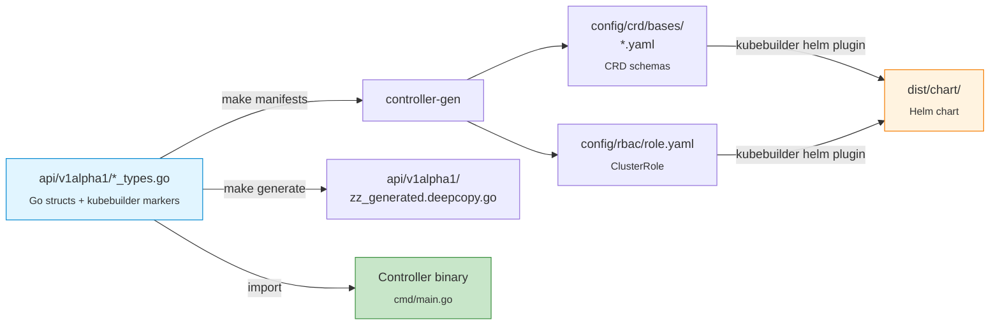
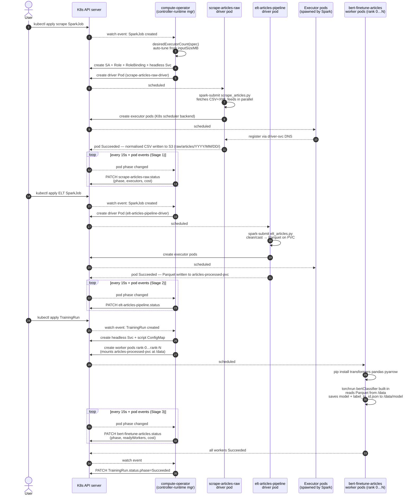
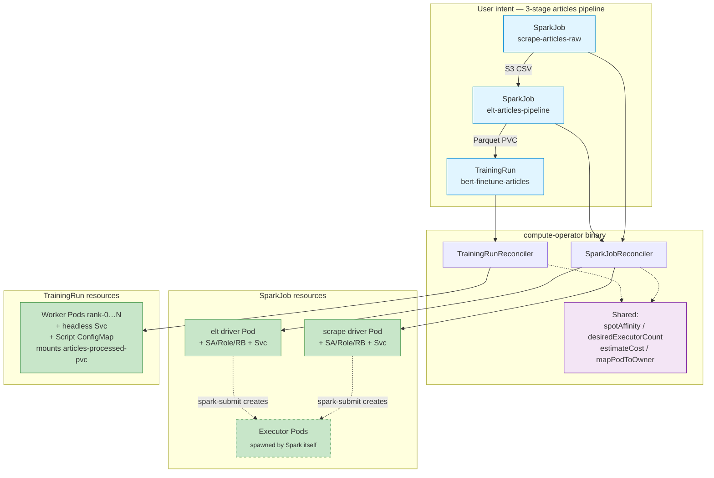
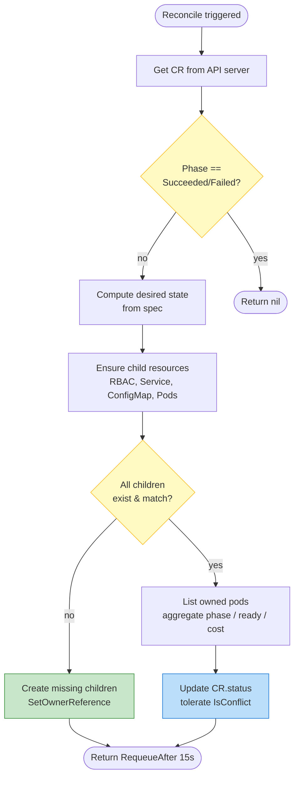

# compute-operator

A Kubernetes operator that runs **Apache Spark jobs** and **distributed PyTorch training** as first-class custom resources. Built with [kubebuilder](https://book.kubebuilder.io/) v4 in Go.

Two CRDs (`SparkJob`, `TrainingRun`) share one controller binary and a common set of cross-cutting features: spot-aware scheduling, executor/worker auto-tuning, GPU plumbing, checkpoint hooks, and live cost accounting.

---

## Why this exists

`spark-on-k8s-operator` and `kubeflow/training-operator` already cover the basics. This project differentiates by:

- **One CRD shape across Spark and ML.** `phase`, `estimatedCostUSD`, `spot.maxRetries`, `resourceHint.inputSizeMB`, `gpu.*` — same fields, same status, one dashboard reads both.
- **Auto-tuned executor/worker counts** from a single `resourceHint.inputSizeMB`, clamped to `[min,max]`.
- **Spot-eviction recovery.** Both controllers track `retries`/`resumes` against `spot.maxRetries` and recreate the workload.
- **Real `spark-submit`** via Spark's native K8s scheduler backend in client mode — no `spark-operator` dependency.
- **Inline Python scripts** for `TrainingRun` (`spec.script`) materialized as a ConfigMap and mounted at `/scripts/train.py`. No custom image required for demos.
- **Declarative GPU block** (`spec.gpu`) → the controller emits `nvidia.com/gpu` resources, node selector, runtime class, NCCL backend, and `torchrun --nproc_per_node`.

---

## What's new in this revision

- **Schema pivoted from "orders" to "articles".** The pipeline now scrapes real public sources (HN RSS, Reddit RSS, OWID CSV) into the schema `id, source, title, link, published_at, summary, category`. ELT casts dates, strips HTML, partitions by `published_date`.
- **CR names renamed**: `scrape-orders-raw` → `scrape-articles-raw`, `elt-orders-pipeline` → `elt-articles-pipeline`, `bert-finetune-orders[-gpu]` → `bert-finetune-articles[-gpu]`. PVC is `articles-processed-pvc`. File paths in S3 are `raw/articles/`, `processed/articles/`.
- **Native cron on `SparkJob`.** New `spec.schedule` (5-field cron), plus `suspend`, `timeZone`, `concurrencyPolicy` (Allow/Forbid/Replace), `startingDeadlineSeconds`, `successfulJobsHistoryLimit`, `failedJobsHistoryLimit`. When set, the SparkJob is a *template* — the controller spawns child runs at each fire time. See [The CRDs § SparkJob](#sparkjob).
- **Secret/ConfigMap projection on `SparkJob`.** New `spec.env` and `spec.envFrom` (standard `corev1` shapes). The controller auto-derives `spark.kubernetes.executor.{secret,configMap}KeyRef.*` so executors inherit the same env without restating it in `sparkConf`. Used for AWS credentials via an `aws-creds` Secret.
- **Built-in trainer on `TrainingRun`.** New `spec.builtinTrainer: BERTClassifier` — controller injects a Parquet-reading DDP BERT classifier (DistilBERT on CPU, ModernBERT on GPU, auto-detect). No more 100-line Python pasted into YAML.
- **Custom Spark image** with `hadoop-aws` + `aws-java-sdk-bundle` baked in (`compute-operator/spark-s3:3.5.3`). Build with `make spark-image-k3d`.
- **`make upload-jobs`** pushes `jobs/*.py` + `scrape_urls.json` to S3 at the layout the SparkJob CRs reference. Resumable; no path-typo surprises.
- **Polite waiting for dependencies.** Missing referenced Secret/ConfigMap → SparkJob goes `Pending` with a `DependenciesReady=False` condition message naming the missing object. No more reconcile error storms.
- **Prometheus scrapes the laptop.** [`config/prometheus/laptop_target.yaml`](config/prometheus/laptop_target.yaml) lets the in-cluster Prometheus (kube-prometheus-stack) scrape `make run`'s `/metrics` over the docker bridge — no in-cluster controller required. `make run` / `make run-with-webhooks` now expose plain HTTP on `:8080`.

---

## Architecture at a glance

### Codegen pipeline — Go types are the source of truth



### Runtime — what happens when you `kubectl apply` the pipeline



### Two CRDs, one controller binary, shared subsystems



### What each reconciler does on every pass



**Project layout**

| Path | What's there |
|------|--------------|
| `api/v1alpha1/` | Go types — source of truth for both CRDs |
| `internal/controller/` | Reconcilers + unit/integration tests (envtest) |
| `internal/webhook/v1alpha1/` | Validating admission webhooks + their tests |
| `internal/metrics/` | Custom Prometheus metrics + helpers |
| `cmd/main.go` | Manager entrypoint (registers both controllers + webhooks) |
| `config/` | Kustomize manifests (CRDs, RBAC, Deployment, samples) |
| `config/samples/` | Working `SparkJob` and `TrainingRun` CRs (3-stage pipeline) |
| `dist/chart/` | Generated Helm chart (mirror of `config/`) |
| `jobs/` | PySpark + Python scripts: `scrape_articless.py`, `elt_articles.py`, `scrape_urls.json` |
| `scripts/install-nvidia-drivers.sh` | Host-level driver install for GPU nodes |
| `Makefile` | Build, test, lint, deploy, GPU stack targets |

---

## Quickstart on k3d (CPU only, no GPUs needed)

```bash
# 1. Cluster
k3d cluster create compute-op --servers 1 --agents 1 --wait
kubectl config use-context k3d-compute-op

# 2. Install CRDs + run the controller locally
make install
make run                  # foreground; blocks. Open a new terminal for the steps below.
```

### The 3-stage articles pipeline

The samples ship a complete end-to-end pipeline scraping real public sources (Hacker News RSS, Reddit RSS, OWID CSV). Each stage is a separate custom resource; run them in order:

```
Stage 1 ─ scrape-articles-raw     (SparkJob)    distributed HTTP scraper: RSS/XML + CSV feeds → S3 landing zone
Stage 2 ─ elt-articles-pipeline   (SparkJob)    clean/cast/partition → Parquet on PVC
Stage 3 ─ bert-finetune-articles  (TrainingRun) DistilBERT/ModernBERT fine-tune via the controller-supplied script
```

#### Prerequisites (one-time per cluster)

```bash
# 1. Custom Spark image with hadoop-aws + aws-java-sdk-bundle baked in
make spark-image-k3d                # downloads jars to cluster/spark/jars/, builds, imports

# 2. AWS credentials for the Spark drivers (envFrom-injected)
kubectl -n default create secret generic aws-creds \
  --from-literal=AWS_ACCESS_KEY_ID=AKIA... \
  --from-literal=AWS_SECRET_ACCESS_KEY=...

# 3. Push Python jobs + scrape_urls.json to S3 (the path the SparkJob CRs reference)
make upload-jobs S3_BUCKET=spark-lake-2998043
```

#### Run the pipeline

```bash
# Apply everything (samples include the articles-processed-pvc PVC):
kubectl apply -k config/samples
# Or apply individually in order:
# kubectl apply -f config/samples/articles_processed_pvc.yaml
# kubectl apply -f config/samples/compute_v1alpha1_sparkjob_scrape.yaml
# kubectl apply -f config/samples/compute_v1alpha1_sparkjob.yaml
# kubectl apply -f config/samples/compute_v1alpha1_trainingrun.yaml

# Stage 1 — scrape RSS + CSV into S3
kubectl get sparkjob scrape-articles-raw -w
kubectl logs scrape-articles-raw-driver -f      # [scrape] total rows scraped: N

# Stage 2 — ELT: clean → Parquet, partitioned by published_date
kubectl get sparkjob elt-articles-pipeline -w
kubectl logs elt-articles-pipeline-driver -f    # [load] rows written (good): N

# Stage 3 — BERT fine-tune (CPU, gloo). Pre-pull the pytorch image (~5 GB) first:
docker pull pytorch/pytorch:2.5.1-cuda12.4-cudnn9-runtime
k3d image import pytorch/pytorch:2.5.1-cuda12.4-cudnn9-runtime -c compute-op

kubectl logs bert-finetune-articles-rank-0 -f
# [rank 0/2] model=distilbert-base-uncased backend=gloo device=cpu
# [data] 60 rows | 4 classes | text=title label=source
# [rank 0] epoch=0 avg_loss=1.32 ...
# [rank 0] model + label map saved to /data/model
```

#### How the stages connect

```
jobs/scrape_urls.json   (HN frontpage, HN best, Reddit r/programming, OWID CO2 CSV)
      │
      ▼
scrape-articles-raw ──writes──► s3://.../raw/articles/YYYY/MM/DD/   (CSV, partitioned by source)
                                          │
                                          ▼
                          elt-articles-pipeline ──writes──► s3://.../processed/articles/    (Parquet)
                                                                       │
                                                                       ▼   (via articles-processed-pvc)
                                                       bert-finetune-articles
                                                       reads /data/published_date=*/*.parquet
                                                       saves /data/model/ + label_to_id.json
```

- **No inline Python in YAML.** The trainer script lives in Go ([builtin_trainer_bert.go](internal/controller/builtin_trainer_bert.go)) and is materialized as a ConfigMap when `spec.builtinTrainer: BERTClassifier` is set.
- **Env-tunable hyperparams.** `TEXT_COLUMN`, `LABEL_COLUMN`, `NUM_LABELS`, `BERT_MODEL`, `DATA_PARQUET_GLOB`, `EPOCHS`, `BATCH_SIZE`, `MAX_LENGTH`, `LR` — swap any without rebuilding the controller.
- **The scraper does both RSS (XML) and CSV** in a single mapPartitions pass; the ELT job normalises both into a unified schema.

#### Pipeline PVC

The ELT job writes Parquet to `articles-processed-pvc`; the TrainingRun mounts it read-only. The PVC ships in the samples as [config/samples/articles_processed_pvc.yaml](config/samples/articles_processed_pvc.yaml) and is applied automatically by `kubectl apply -k config/samples`. On k3d the default `local-path` provisioner binds it; on EKS/GKE add a `storageClassName`.

On a real cluster, back this with your storage class of choice (EFS, EBS, NFS). On k3d the default `local-path` provisioner works for single-node testing.

---

## GPU setup (real clusters only)

k3d / kind / minikube do **not** support GPUs — the device plugin needs real NVIDIA hardware visible to the kernel. Everything below assumes a real cluster (EKS / GKE / on-prem) with at least one node that has a physical or pass-through NVIDIA GPU.

### Hardware + OS requirements

| Component | Supported |
|-----------|-----------|
| GPU | Any NVIDIA card with compute capability ≥ 5.0 (Maxwell+). Tesla T4 / A10G / A100 / H100 / RTX 3xxx-5xxx all work. |
| Architecture | `x86_64` or `aarch64` (Grace-Hopper). |
| Host OS | Ubuntu 20.04 / 22.04 / 24.04, Debian 12, RHEL 8 / 9, Rocky 9, AlmaLinux 9, Amazon Linux 2023. |
| Kernel | Stock distro kernel; the install script invokes DKMS / kernel-headers automatically. |
| Container runtime | `containerd` (default for k3s / EKS / GKE) or `docker`. CRI-O is supported by the GPU Operator but not by our install script. |
| Kubernetes | 1.27+ |
| Disk | ≥ 10 GB free per node — the driver + CUDA libs are large. |
| RAM | ≥ 4 GB per node for the operator's driver DaemonSet to compile. |

### Step 1 — install host drivers on every GPU node

`scripts/install-nvidia-drivers.sh` handles distro detection, nouveau blacklisting, driver via DKMS, the NVIDIA Container Toolkit, and runtime wiring.

```bash
# Copy the script to each GPU node, run as root, reboot once.
scp scripts/install-nvidia-drivers.sh <node>:/tmp/
ssh <node> 'sudo /tmp/install-nvidia-drivers.sh --reboot'

# Flags:
#   --driver-branch 550   Pin to a specific driver branch (default: latest stable)
#   --reboot              Reboot at the end (driver kmod loads on next boot)
#   --skip-toolkit        Driver only
#   --skip-driver         Toolkit only (driver already installed)
```

**Smoke-test after the node comes back up:**

```bash
ssh <node> 'nvidia-smi'                          # must list the GPU + driver version
ssh <node> 'sudo ctr run --rm --gpus 0 -t \
   docker.io/nvidia/cuda:12.4.1-base-ubuntu22.04 cuda-smoke nvidia-smi'
```

If both work, the host is ready.

### Step 2 — install the NVIDIA GPU Operator (cluster-side)

The Operator installs the device plugin (advertises `nvidia.com/gpu` as an extended resource), the runtime class (`runtimeClassName: nvidia`), and node labels (`nvidia.com/gpu.present=true`, `nvidia.com/gpu.count=N`).

```bash
# Since you pre-installed driver + toolkit via the script, disable the
# operator's own DaemonSets for those (avoids conflicts):
make install-gpu-operator \
  GPU_DRIVER_ENABLED=false \
  GPU_TOOLKIT_ENABLED=false
```

If you skipped the host-install script and want the Operator to do everything:

```bash
make install-gpu-operator        # driver + toolkit enabled
```

**Verify:**

```bash
kubectl -n gpu-operator get pods                      # all Running
kubectl get nodes -L nvidia.com/gpu.present -L nvidia.com/gpu.count
# NAME       …  GPU.PRESENT   GPU.COUNT
# gpu-node-1 …  true          1
kubectl get runtimeclass nvidia                       # exists
kubectl describe node gpu-node-1 | grep -A2 'nvidia.com/gpu'
# Capacity:
#   nvidia.com/gpu: 1
```

### Step 3 — install the operator and run the GPU sample

```bash
make install                                          # CRDs
make deploy IMG=ghcr.io/<you>/compute-operator:v0.1.0 # controller in-cluster
kubectl apply -f config/samples/compute_v1alpha1_trainingrun_gpu.yaml
kubectl logs bert-finetune-articles-gpu-rank-0 -f
```

What the controller emits for a CR with `spec.gpu.enabled=true, perWorker=1, runtimeClass=nvidia, backend=nccl`:

```yaml
# (generated per worker pod, abridged)
spec:
  runtimeClassName: nvidia
  nodeSelector:
    nvidia.com/gpu.present: "true"
  tolerations:
    - key: nvidia.com/gpu
      operator: Exists
      effect: NoSchedule
  containers:
    - name: worker
      command: ["/bin/sh", "-c"]
      args: ["pip install --quiet transformers==4.44.2 && \
              exec torchrun --nnodes=$WORLD_SIZE --nproc_per_node=1 \
                --node_rank=$RANK --master_addr=$MASTER_ADDR \
                --master_port=$MASTER_PORT /scripts/train.py"]
      env:
        - { name: TORCH_DISTRIBUTED_DEFAULT_BACKEND, value: nccl }
        # …RANK / WORLD_SIZE / MASTER_ADDR / MASTER_PORT
      resources:
        requests: { nvidia.com/gpu: "1" }
        limits:   { nvidia.com/gpu: "1" }
```

### GPU-specific TrainingRun knobs

| Field | Default | Notes |
|-------|---------|-------|
| `gpu.enabled` | `false` | Master switch. When false, no GPU plumbing is added. |
| `gpu.perWorker` | `1` | GPUs per pod. Becomes `nvidia.com/gpu` resource + `torchrun --nproc_per_node`. |
| `gpu.nodeSelector` | `{nvidia.com/gpu.present: "true"}` | Override on non-GPU-Operator clusters (e.g. cloud-provider node labels like `accelerator: a100`). |
| `gpu.runtimeClass` | `""` | Set to `"nvidia"` on clusters where the NVIDIA runtime is registered as a RuntimeClass (true after `install-gpu-operator`). Leave empty if `nvidia` is the cluster's default runtime. |
| `gpu.backend` | `nccl` when enabled, `gloo` otherwise | Collective backend for `torch.distributed`. NCCL required for inter-GPU all-reduce; gloo for CPU. |

### Common GPU pitfalls

| Symptom | Cause | Fix |
|---------|-------|-----|
| Pod stuck `Pending`, `kubectl describe` shows *"0/N nodes available: N node(s) didn't match Pod's node affinity"* | No node is labeled `nvidia.com/gpu.present=true` | GPU Operator not installed, or installed but failed. Check `kubectl -n gpu-operator get pods`. |
| Pod stuck `Pending`, *"Insufficient nvidia.com/gpu"* | All GPUs on labeled nodes are already requested by other pods | Scale up GPU nodes or lower `gpu.perWorker` × `worldSize`. |
| Pod `ContainerCreating` forever, event *"RuntimeClass nvidia not found"* | `runtimeClass: nvidia` is set but the RuntimeClass object doesn't exist | `kubectl get runtimeclass`; if missing, install/reinstall GPU Operator, or set `gpu.runtimeClass: ""`. |
| Pod `CrashLoopBackOff` with *"CUDA initialization: no CUDA-capable device is detected"* inside the container | Driver version older than what CUDA in the image needs | Match driver to CUDA: PyTorch 2.5 + CUDA 12.4 needs driver ≥ 550. Re-run `install-nvidia-drivers.sh --driver-branch 550`. |
| NCCL hangs on `init_process_group` | Workers can't reach each other on port 29500 | NetworkPolicy blocking it, or pod security policy. Allow intra-namespace traffic on TCP 29500. |
| `nvidia-smi` works on the host but not in the pod | Container runtime not configured with the nvidia runtime | Re-run `install-nvidia-drivers.sh` (configures `containerd` automatically), or `nvidia-ctk runtime configure --runtime=containerd --set-as-default` manually. |

### What if my cluster has no GPU but I want to dry-run the GPU YAML?

You can apply `compute_v1alpha1_trainingrun_gpu.yaml` on k3d. The CRD validation passes; pods land in `Pending` with `didn't match Pod's node affinity` — that's the controller doing the right thing. It's a useful test that your manifest renders correctly before pushing to a real GPU cluster.

---

## The CRDs

### `SparkJob`

| Field | Purpose |
|-------|---------|
| `image` | Spark distribution (defaults to `apache/spark:3.5.3`) |
| `type` | `Scala` / `Python` / `R` |
| `mainClass`, `mainApplicationFile`, `arguments` | What to submit |
| `executors`, `minExecutors`, `maxExecutors` | Static or auto-tuned executor count |
| `resourceHint.inputSizeMB` | Drives auto-tuner: ~1 executor per 256 MB, clamped to `[min,max]` |
| `resourceHint.costPerHourUSD` | Cost-per-pod for `status.estimatedCostUSD` |
| `driverResources`, `executorResources` | Standard K8s requests/limits |
| `sparkConf` | Free-form `--conf key=value` pairs |
| `env`, `envFrom` | Standard `corev1` env + Secret/ConfigMap projection on the driver. Controller auto-derives `spark.kubernetes.executor.{secret,configMap}KeyRef.*` so executors inherit the same env. |
| `spot.{enabled,mode,maxRetries}` | Schedule on spot nodes, retry on eviction |
| `checkpoint.{enabled,s3URI,credentialsSecret,interval}` | Future: checkpoint backend |
| `serviceAccount` | Override the auto-created driver SA |
| `schedule` | 5-field cron (`"min hour dom mon dow"`). When set, this CR becomes a **template** — the controller spawns child SparkJobs at each fire time instead of running directly. Mirrors `batch/v1` CronJob semantics. |
| `suspend` | Pause scheduling without deleting the template. Existing children keep running. |
| `timeZone` | IANA TZ for cron evaluation. Defaults to UTC. |
| `concurrencyPolicy` | `Allow` / `Forbid` (default) / `Replace` — what to do when a fire time hits and a previous run is still active. |
| `startingDeadlineSeconds` | Skip missed fires older than this. |
| `successfulJobsHistoryLimit`, `failedJobsHistoryLimit` | Keep this many finished children per outcome (default 3 each). |

**One-shot mode** (default): controller creates ServiceAccount + Role + RoleBinding for the driver, a headless Service for `spark.driver.host`, then the driver pod running `spark-submit --master k8s://... --deploy-mode client …`. Spark spawns executor pods via the K8s scheduler backend.

**Scheduled mode** (`spec.schedule` set): no driver pod for the template — the reconciler parses the cron expression, computes the next fire time, and creates a child `SparkJob` named `<parent>-<unix>` at each tick. Status surfaces `lastScheduleTime`, `nextScheduleTime`, and `active` (refs to in-flight children). History is pruned per the limits above. Impossible schedules (e.g. `0 0 31 2 *`) are detected and short-circuit — no infinite loops.

### `TrainingRun`

| Field | Purpose |
|-------|---------|
| `framework` | `PyTorch` / `Ray` |
| `image` | Image with the framework (+ optionally the training code) |
| `worldSize` | Number of worker pods (one is rank 0) |
| `command`, `args`, `env` | Override the default torchrun launch |
| `script` | Inline Python; materialized as ConfigMap, mounted at `/scripts/train.py`, run by default torchrun |
| `builtinTrainer` | Picks a controller-supplied script instead of pasting Python into YAML. Currently: `BERTClassifier` (Parquet → DDP BERT classifier; DistilBERT on CPU, ModernBERT on GPU; env-tunable). Lives in [`internal/controller/builtin_trainer_bert.go`](internal/controller/builtin_trainer_bert.go). `script` wins if both are set. |
| `packages` | `pip install` before launch (handy for `transformers`, etc.) |
| `workerResources` | Standard K8s requests/limits (set `nvidia.com/gpu` for GPU) |
| `datasetPVC` | PVC mounted read-only at `/data` |
| `gpu.{enabled,perWorker,runtimeClass,nodeSelector,backend}` | Declarative GPU plumbing |
| `spot.{enabled,maxRetries}` | Spot-eviction recovery |
| `resourceHint.costPerHourUSD` | Live cost in status |
| `checkpoint.*` | Future: checkpoint resume on retry |

The controller creates: a headless Service for ranked DNS, the script ConfigMap, and N worker pods each with stable hostnames `<run>-rank-N.<run>-workers.<ns>.svc.cluster.local` and env vars `RANK`, `WORLD_SIZE`, `MASTER_ADDR`, `MASTER_PORT`.

---

## Makefile targets

Run `make help` for the full list. The targets you'll actually use day-to-day:

### Inner-loop development

| Command | When to run | What it does |
|---------|-------------|--------------|
| `make manifests` | **After editing `api/v1alpha1/*_types.go`** | Re-runs controller-gen to regenerate `config/crd/bases/*.yaml` and `config/rbac/role.yaml` from your Go markers |
| `make generate` | After editing `*_types.go` | Regenerates `zz_generated.deepcopy.go` |
| `make fmt` / `make vet` | Before commits | Standard Go checks |
| `make lint` | Before commits / in CI | golangci-lint (modernize, gosec, govet, etc.) |
| `make test` | Before commits / in CI | Runs envtest-backed Ginkgo specs in `internal/controller/` |
| `make build` | Before docker-build | Builds the manager binary into `bin/manager` |

### Running the controller

| Command | What it does |
|---------|--------------|
| `make install` | Applies CRDs from `config/crd/` into the current kube context |
| `make uninstall` | Removes CRDs (also deletes all CRs because of GC) |
| `make run` | Runs the controller from your laptop against the current kube context. Blocks the terminal. Re-runs `manifests generate fmt vet` automatically |
| `make deploy IMG=<repo>:<tag>` | Builds + applies the controller as a Deployment in-cluster (Kustomize) |
| `make undeploy` | Removes the in-cluster controller Deployment |

### Image build

| Command | What it does |
|---------|--------------|
| `make docker-build IMG=<repo>:<tag>` | `docker build` the controller image |
| `make docker-push IMG=<repo>:<tag>` | Push it |
| `make docker-buildx IMG=<repo>:<tag>` | Multi-arch buildx |

### Pipeline assets

| Command | What it does |
|---------|--------------|
| `make spark-jars` | Downloads `hadoop-aws-3.3.4.jar` + `aws-java-sdk-bundle-1.12.262.jar` into `cluster/spark/jars/` via `curl -C -` (resumable, cached). |
| `make spark-image` | Runs `spark-jars`, then `docker build cluster/spark` to produce `compute-operator/spark-s3:3.5.3` — `apache/spark:3.5.3` with the S3A jars baked in. |
| `make spark-image-k3d` | Builds the image and imports it into the local k3d cluster. |
| `make upload-jobs S3_BUCKET=<name>` | Pushes `jobs/scrape_articles.py`, `jobs/elt_articles.py`, `jobs/scrape_urls.json` to `s3://<bucket>/{jobs,config}/`. Uses standard AWS SDK auth chain. |

### GPU stack (real clusters only)

| Command | What it does |
|---------|--------------|
| `make install-nvidia-drivers` | Prints SSH-and-run instructions for `scripts/install-nvidia-drivers.sh` |
| `make install-gpu-operator` | Helm-installs NVIDIA GPU Operator (driver + toolkit DaemonSets enabled) |
| `make install-gpu-operator GPU_DRIVER_ENABLED=false GPU_TOOLKIT_ENABLED=false` | Same, but assumes you ran `scripts/install-nvidia-drivers.sh` on each node first |
| `make uninstall-gpu-operator` | Helm-uninstalls it |

---

## The "what do I run after I change X" cheatsheet

| You changed… | Run |
|--------------|-----|
| A field in `api/v1alpha1/*_types.go` | `make manifests generate` then `make install` (so the new CRD schema is in the cluster) then restart `make run` |
| Controller logic in `internal/controller/*.go` | Just restart `make run` |
| The built-in trainer script in `builtin_trainer_bert.go` | Restart `make run` and re-apply / re-create the TrainingRun (the ConfigMap is re-materialized from the new const) |
| A `+kubebuilder:rbac:…` marker | `make manifests` (regenerates `config/rbac/role.yaml`); if running in-cluster, `make deploy IMG=…` to push new RBAC |
| A sample CR YAML | `kubectl apply -f config/samples/<file>` (controller picks it up immediately) |
| `jobs/scrape_articles.py` / `jobs/elt_articles.py` / `jobs/scrape_urls.json` | `make upload-jobs S3_BUCKET=…` to push to S3 — SparkJob references the S3 path, not the local file |
| Hadoop / AWS SDK version in `cluster/spark/Dockerfile` | `make spark-image-k3d` to rebuild + re-import |
| The Makefile / docs only | Nothing operational |

### Manual re-apply ritual (no GitOps yet)

When you change Go code while a `SparkJob` is mid-flight, the existing driver pod is stale — it was launched against the old code. The driver pod is immutable, so the cleanest reset is:

```bash
# 1. Kill the controller (port 8081 is the health probe; that's the easiest signal to find it)
lsof -nP -iTCP:8081 -sTCP:LISTEN -t | xargs kill -9

# 2. Delete the stale CR + child resources (OwnerReferences cascade-delete pods/SA/RBAC/Service)
kubectl delete sparkjob elt-articles-pipeline
# (or just the driver pod if the CR itself is still good)
kubectl delete pod elt-articles-pipeline-driver

# 3. Reinstall CRDs if you changed *_types.go
make install

# 4. Restart the controller in a fresh terminal
make run

# 5. Re-apply the samples in pipeline order
kubectl apply -f config/samples/compute_v1alpha1_sparkjob_scrape.yaml
kubectl apply -f config/samples/compute_v1alpha1_sparkjob.yaml
kubectl apply -f config/samples/compute_v1alpha1_trainingrun.yaml
```

**ArgoCD eliminates most of this loop** — see [`gitops/README.md`](gitops/README.md) for the full setup. TL;DR:

```bash
make install-argocd          # one-time
make gitops-bootstrap        # registers compute-operator + samples Applications

# Now changes flow three ways without manually rerunning kubectl apply:
#   1. Git auto-sync (push to main; controller picks it up in ~60s)
#   2. Local sync   — argocd app sync compute-operator --local ./config/default
#   3. Param set    — argocd app set compute-operator --kustomize-image controller=…
```

Crucially the `samples` Application has auto-sync **OFF** so applying `compute_v1alpha1_sparkjob.yaml` is still a deliberate `argocd app sync samples` (or `make gitops-sync-samples`) — sample CRs spawn real driver/executor pods, you don't want them re-created on every commit.

---

## Tests + CI

```bash
make test        # ginkgo + envtest, ~8s, runs against a real Kubernetes API in-process
make lint        # golangci-lint, must report "0 issues"
```

8 Ginkgo specs cover both controllers' happy path, GPU mutations, RBAC creation, and pure unit functions like `desiredExecutorCount`.

For a full pre-push verification:

```bash
make manifests generate fmt vet lint test
```

---

## Deploying for real (in-cluster controller)

```bash
make docker-build docker-push IMG=ghcr.io/<you>/compute-operator:v0.1.0
make deploy IMG=ghcr.io/<you>/compute-operator:v0.1.0

kubectl -n compute-operator-system get pods   # controller manager Deployment
```

Or via Helm:

```bash
helm upgrade --install compute-op ./dist/chart \
  --namespace compute-operator-system --create-namespace
```

(Regenerate the chart after CRD changes with `kubebuilder edit --plugins=helm/v1-alpha`.)

---

## Observability (Prometheus + Grafana)

The controller emits custom domain metrics on top of the controller-runtime defaults. With kube-prometheus-stack installed, every `SparkJob` and `TrainingRun` shows up as live timeseries.

### What's emitted

`/metrics` on the manager pod (`:8443` HTTPS or `:8080` HTTP depending on `--metrics-secure`) carries:

| Metric | Type | Labels | What it tells you |
|--------|------|--------|-------------------|
| `compute_operator_sparkjob_reconciles_total` | counter | `result` (success/error) | Reconcile traffic + error rate |
| `compute_operator_sparkjob_phase` | gauge | `namespace`, `name`, `phase` | 1 for the active phase, 0 for others — clean step function per job |
| `compute_operator_sparkjob_executors_running` | gauge | `namespace`, `name` | Live executor pod count |
| `compute_operator_sparkjob_executors_desired` | gauge | `namespace`, `name` | What the auto-tuner wants — diff vs running shows scheduling drag |
| `compute_operator_sparkjob_retries_total` | gauge | `namespace`, `name` | Spot-retry attempts consumed |
| `compute_operator_sparkjob_cost_usd` | gauge | `namespace`, `name` | Live cost estimate |
| `compute_operator_trainingrun_*` | (mirrors of the above) | | Same shape for `TrainingRun` |

Plus everything controller-runtime exposes by default: `controller_runtime_reconcile_*`, `workqueue_*`, `rest_client_*`, Go runtime metrics, leader-election status.

### Install the stack (one-time per cluster)

Three variants depending on your cluster and how much you care about admission validation:

| Command | Admission webhooks | Cert source | Works on |
|---------|--------------------|-------------|----------|
| `make install-prometheus` | **ON** | `kube-webhook-certgen` Job | Real clusters (EKS / GKE / on-prem) |
| `make install-prometheus-local` | **OFF** | — | k3d / k3s / kind (skips the broken Job) |
| `make install-prometheus-certmanager` | **ON** | cert-manager-issued | k3d **+** real clusters (proper path) |

```bash
# Real cluster
make install-prometheus

# k3d, give up on webhook validation
make install-prometheus-local

# k3d, keep webhook validation — installs cert-manager first, then the chart
make install-prometheus-certmanager

# Then in any case:
make enable-metrics-monitoring
```

Why three? The chart's bundled `kube-webhook-certgen` Job creates the webhook TLS cert at install time, but on k3d/k3s it 401s against the API server because of how those distros project ServiceAccount tokens. The recommended fix in production is **cert-manager** — it owns cert lifecycle properly, works everywhere, and avoids the init Job altogether. `install-prometheus-certmanager` is the one-shot target that bootstraps cert-manager **and** the Prometheus stack wired to use it.

The `_*local*_` variant is purely a convenience: drop the admission webhooks (you lose nothing for monitoring purposes — they only validate `ServiceMonitor`/`Prometheus`/`Alertmanager` CRs you create) and skip the cert-manager dependency entirely.

You can also flip the toggles on the main target directly:

```bash
make install-prometheus PROM_ADMISSION_WEBHOOKS=false                  # same as -local
make install-prometheus PROM_ADMISSION_WEBHOOKS=true PROM_USE_CERTMANAGER=true   # same as -certmanager (assumes cert-manager already installed)
```

The chart is installed with `serviceMonitorSelectorNilUsesHelmValues=false` so it discovers any `ServiceMonitor` in any namespace — no extra labels needed on ours.

### Open the dashboards

```bash
make prometheus-ui     # http://localhost:9090
make grafana-ui        # http://localhost:3000  user: admin  pass: prom-operator
```

In Prometheus UI, check `Status → Targets` — you should see one of:

- `controller-manager-metrics-monitor` UP → the controller is running **in-cluster** (after `make deploy`).
- `laptop-controller-metrics` UP → the controller is running on your **laptop** via `make run` (after `make enable-metrics-monitoring`; see below).

Useful PromQL to try in the **Graph** tab:

```promql
# Phase timeline for every SparkJob
compute_operator_sparkjob_phase == 1

# Reconcile error rate over the last 5 min
rate(compute_operator_sparkjob_reconciles_total{result="error"}[5m])

# Total spend across all jobs right now
sum(compute_operator_sparkjob_cost_usd) + sum(compute_operator_trainingrun_cost_usd)

# Auto-tuner drag — desired vs running executors per job
compute_operator_sparkjob_executors_desired - compute_operator_sparkjob_executors_running
```

### Grafana dashboard

Grafana auto-discovers Prometheus as a datasource. You can either:
- Use the kube-prometheus-stack's pre-canned **Kubernetes / Compute Resources / Namespace (Workloads)** to see the controller's CPU/memory/restart timeline, or
- Build a custom dashboard using the PromQL above. The metric naming is `compute_operator_*` so it auto-completes cleanly in the metric browser.

### Troubleshooting

| Symptom | Cause | Fix |
|---------|-------|-----|
| `controller-manager-metrics-monitor` target missing in Prometheus | ServiceMonitor not applied or wrong selector | `kubectl get servicemonitor -A \| grep controller-manager`; if missing, `make enable-metrics-monitoring`. |
| Target shows `DOWN` with `tls: failed to verify certificate` | The default `monitor.yaml` uses `insecureSkipVerify: true` — that should work. If you uncommented the `monitor_tls_patch.yaml` patch but didn't install cert-manager, scraping fails on the cert verification step. | Either install cert-manager (the patch references its issued secret) or revert to the default `monitor.yaml`. |
| `compute_operator_*` metrics show up but never increment | Controller can't connect to the API server, so reconciles never run | `kubectl -n compute-operator-system logs deployment/controller-manager` |
| Stale metrics linger after deleting a CR | Cleanup races with deletion | The reconciler calls `metrics.DeleteSpark` / `DeleteTraining` on NotFound — wait one reconcile cycle. |

### Scraping `make run` from the in-cluster Prometheus

You don't need to `make deploy` to see metrics in Prometheus. The shipped target [`config/prometheus/laptop_target.yaml`](config/prometheus/laptop_target.yaml) routes the in-cluster Prometheus to the controller running on your laptop via the docker bridge:

```
make run  →  laptop:8080/metrics (plain HTTP)
                  ↑
   docker bridge gateway 172.21.0.1
                  ↑
Prometheus pod → selectorless Service → EndpointSlice (172.21.0.1:8080) → ServiceMonitor (scheme: http)
```

Both `make run` and `make run-with-webhooks` now pass `--metrics-bind-address=:8080 --metrics-secure=false` so `/metrics` is exposed in plain HTTP. The webhook server (when enabled) keeps its own TLS port.

```bash
make run                                    # exposes /metrics on :8080
make enable-metrics-monitoring              # applies Service + EndpointSlice + ServiceMonitor
make prometheus-ui                          # http://localhost:9090
# Status → Targets → `laptop-controller-metrics` should be UP within ~30s
```

If your k3d docker network gateway isn't `172.21.0.1` (check with `docker network inspect k3d-compute-op`), edit the IP in [`laptop_target.yaml`](config/prometheus/laptop_target.yaml).

### Local-only smoke test (no cluster Prometheus)

When you don't have kube-prometheus-stack installed at all, hit the controller directly:

```bash
make run
curl -s localhost:8080/metrics | grep compute_operator_
# compute_operator_sparkjob_reconciles_total{result="success"} 17
# compute_operator_sparkjob_phase{name="elt-articles-pipeline",namespace="default",phase="Running"} 1
# ...
```

---

## CR validation (admission webhook)

Both CRDs have a **validating admission webhook** (`internal/webhook/v1alpha1/`) that runs on every `CREATE` and `UPDATE` and rejects semantically invalid CRs before they reach the controller. This catches things kubebuilder's OpenAPI markers can't express.

### What the SparkJob webhook enforces

- `mainApplicationFile` is non-empty
- `executors`, `minExecutors`, `maxExecutors` are non-negative; `min <= max` when both set
- Warns when `executors` is set AND auto-tune bounds are set (auto-tune is silently disabled)
- Warns when `type=Scala` and `mainClass` is empty (works for fat-JARs only)
- Warns when `type=Python` and `mainClass` is set (ignored)
- `checkpoint.s3URI` is required when `checkpoint.enabled=true`; must start with `s3://` or `s3a://`
- `resourceHint.costPerHourUSD` parses as a non-negative float
- `executorResources.requests.cpu` is > 0 (the millicores → cores rounding would fail at 0)
- `spot.maxRetries >= 0`
- Warns on `sparkConf` keys that don't start with `spark.`

### What the TrainingRun webhook enforces

- `image` non-empty, `worldSize >= 1`
- `datasetPVC` and `datasetS3URI` are mutually exclusive; `datasetS3URI` must start with `s3://` or `s3a://`
- Warns when `script` is set AND `command` is overridden (your custom command bypasses the default torchrun + /scripts/train.py)
- Warns when `packages` is set AND `command` is overridden (`pip install` only happens in the default command)
- `gpu.perWorker >= 1` when `gpu.enabled=true`
- Warns on `gpu.enabled=true, backend=gloo` (wastes the interconnect) and `gpu.enabled=false, backend=nccl` (NCCL needs CUDA, will crash at `init_process_group`)
- `checkpoint.s3URI` rules same as SparkJob
- `resourceHint.costPerHourUSD` parses

### Enabling / disabling

| Mode | When | How |
|------|------|-----|
| **OFF** (default for `make run`) | Local dev — no TLS certs to manage | `ENABLE_WEBHOOKS=false go run ./cmd/main.go` |
| **ON** (default in cluster) | `make deploy IMG=…` ships the cert-manager-issued certs alongside the controller | Webhook server boots automatically |
| **ON locally** | You want to test rejection paths against your dev cluster | `make run-with-webhooks` — requires certs under `/tmp/k8s-webhook-server/serving-certs/` or `--webhook-cert-path=<dir>` |

The webhook is also covered by **15 unit tests** in `internal/webhook/v1alpha1/*_test.go` (91.6% coverage), so the rules are pinned independently of whether the live server is running.

### Try it

```bash
# With webhooks running (in-cluster):
kubectl apply -f - <<EOF
apiVersion: compute.compute.example.com/v1alpha1
kind: TrainingRun
metadata: { name: bad }
spec:
  image: ""              # rejected: image required
  worldSize: 0           # rejected: worldSize must be >= 1
  gpu: { enabled: true, perWorker: 0 }   # rejected: perWorker must be >= 1
EOF
# Error from server (Invalid): TrainingRun.compute.compute.example.com "bad" is invalid:
#   [spec.image: Required value, spec.worldSize: Invalid value: 0: must be >= 1,
#    spec.gpu.perWorker: Invalid value: 0: must be >= 1 when spec.gpu.enabled=true]
```

---

## Known issues & rough edges

This is a working operator, not a hardened one. The list below is honest — fix priorities ranked by **confidence that it will bite you** in real use. "High" means I've seen or can reproduce the failure; "Medium" means the path exists and is plausible; "Low" means theoretical.

### High — fix before production

| Issue | Where | Why it bites |
|-------|-------|--------------|
| **`humanMem()` only handles whole-Gi or whole-Mi values cleanly.** `1500Mi` → `"1500m"` is fine, but `1.5Gi` → `"1536m"` looks weird in Spark logs; `512Mi` → `"512m"` is correct | `internal/controller/sparkjob_controller.go::humanMem` | Memory tuning will surprise people. Should output `g`/`m` based on the original unit, not byte arithmetic. |
| **Spark image pre-pull is mandatory on slow links.** `apache/spark:3.5.3` is ~600 MB; if the controller creates the driver pod before kubelet finishes pulling, ImagePullBackOff is the default state for ~2 min | The image is set in `sparkjob_types.go` default; no pre-flight check | Document only fix today — `docker pull && k3d image import` in README. A real fix would add a pre-flight Job that pre-pulls on each node. |

### Medium — known but workable

| Issue | Where | Why it bites |
|-------|-------|--------------|
| **ConfigMap updates don't restart worker pods.** Editing `spec.script` updates the ConfigMap, kubelet syncs the new file into the pod's mounted volume eventually, but `torchrun` already loaded the old script | `trainingrun_controller.go::ensureScriptConfigMap` | Iterating on the script is "delete the run, reapply" — same loop as iterating on Go code. Fix would be a script hash annotation on the pod template that forces a restart. |
| **Status uses `Update` not `Patch`.** We tolerate `IsConflict`, but if two writers (controller + a future webhook) race, fields can be lost between reads | both `updateStatus` functions | Today only the reconciler writes status, so the race window is theoretical. Becomes real the moment we add a finalizer or a metrics-collecting sidecar. |
| **Cost accrual doesn't reset on retry.** `estimatedCostUSD` is computed from `startTime` to now; if a retry pushes the workload through a new driver pod, the cost shown is wall-clock since the *first* attempt — which is what the user is actually paying. Arguably correct, but easy to misread as "current pod cost" | `estimateCost()` in `sparkjob_controller.go` | Sample dashboard would need to make this distinction explicit. |
| **Helm chart drifts from `config/`.** `dist/chart/` was generated once via `kubebuilder edit --plugins=helm/v1-alpha` and isn't regenerated by `make manifests`. Bumping a CRD field bumps `config/crd/bases/` but leaves `dist/chart/templates/crd/` stale | `Makefile` doesn't chain chart regen into `manifests` | Either accept Kustomize as the canonical path and treat chart as snapshot, or wire a `chart-sync` target into `manifests`. |
| **`samples.yaml` applies both CPU and GPU TrainingRuns simultaneously.** On a no-GPU cluster the GPU one sits Pending forever and looks like a failure in `argocd app status` | `gitops/applications/samples.yaml` | Either split into per-environment apps, or document the `--resource` filter prominently. |

### Low — theoretical or cosmetic

| Issue | Where | Why it bites |
|-------|-------|--------------|
| **Leader election ID is hardcoded.** `ab130378.compute.example.com` is the kubebuilder-generated default | `cmd/main.go::ctrl.Options` | Two parallel installs in the same namespace would fight for the lease. Almost never relevant in practice. |
| **No reconcile dedup metrics.** Burst reconciles (one CR change triggers ~5 events from owned resources) are wasted CPU | controllers' watch setup | Performance footnote, not correctness. |
| **`mapPodToOwner` walks both label namespaces** | both controllers | If labels were ever swapped/typo'd, one controller could enqueue the other's CRs. Label keys are constants so this is currently impossible. |

### Where to focus next

Pick from "High" before claiming this is production-ready. The webhook + the `humanMem` fix are both ~half a day of work; the others compound.

## Roadmap

- [x] Graceful shutdown in `cmd/main.go` — `--graceful-shutdown-timeout` flag drains in-flight reconciles before exit, releases leader lock cleanly
- [x] ArgoCD setup — `gitops/` with `Application` + `ApplicationSet` manifests, `make install-argocd`, `make gitops-bootstrap`, local-sync escape hatches (see [`gitops/README.md`](gitops/README.md))
- [x] Validating admission webhooks for both CRDs — 15 unit tests at 91.6% coverage
- [x] Prometheus metrics — domain-specific `compute_operator_*` counters/gauges, `make install-prometheus` + `make enable-metrics-monitoring`, port-forward helpers for Prometheus/Grafana UIs
- [ ] Real checkpoint manager (MinIO + S3-compatible) wired to `spec.checkpoint`
- [ ] NodeTerminating-taint watcher → checkpoint before spot eviction
- [ ] Airflow `DAGRun` CRD (third controller)
